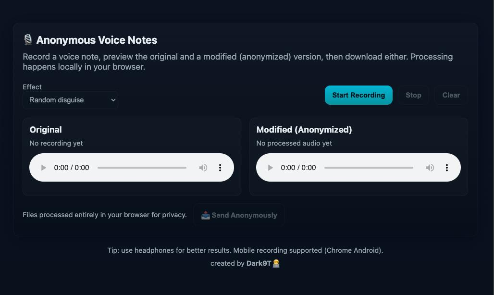

### 🎙️ Anonymous Voice Notes (Frontend)

Record anonymous voice notes directly in your browser, apply disguising effects, preview both the original and modified versions, and send or upload them securely. All processing happens locally on your device for maximum privacy.

---

### 🚀 Features

- **Record audio** from your microphone (desktop and mobile supported).
- **Disguise effects**: chipmunk, deep, robot, echo, random, or minimal EQ.
- **Preview** original and modified versions before sending.
- **Download** both versions locally.
- **Upload** anonymously to a backend API.
- **Privacy-first**: all processing happens entirely in the browser.

---

### 🛠️ Tech Stack

- HTML5 + CSS3
- Vanilla JavaScript (ES6)
- Web Audio API (for audio effects)
- MediaRecorder API (for recording)

---

### 📂 Project Structure

```
frontend/
│── index.html          # Main app UI
│── styles.css          # Custom styling (inlined in HTML)
│── script.js           # Recording & audio processing logic
│── README.md           # Project documentation
```

---

### ⚡ Getting Started

1.  **Clone Repo**

    ```bash
    git clone https://github.com/<your-username>/<repo-name>.git
    cd <repo-name>/frontend
    ```

2.  **Run Locally**

    Simply open **`index.html`** in your browser. No build tools required ✅.

3.  **Deploy**

    You can host this frontend on Vercel, Netlify, or GitHub Pages. Just drag and drop or connect your repo.

---

### 🔌 API Integration

The frontend uploads voice notes to your backend API:

`POST https://mozibix-anonymous-voice-notes-backe.vercel.app/api/upload-voice`

**Payload**:

- **`audio`** → Modified audio file (WAV).
- **`effect`** → Selected disguise effect.
- **`userAgent`** → Browser user agent string.

---

### 📸 Screenshot



### 👨‍💻 Author

created by Dark9T 🧑‍💻
